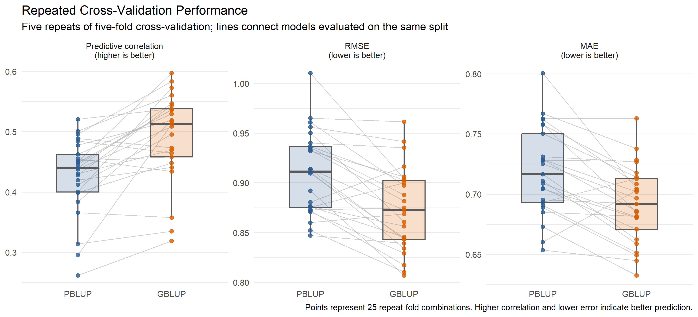
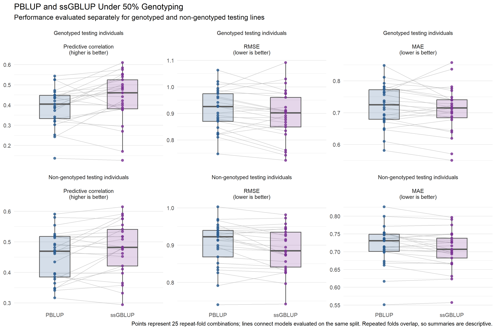
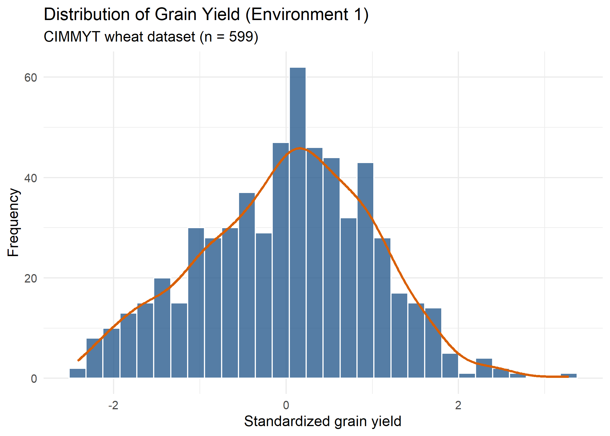
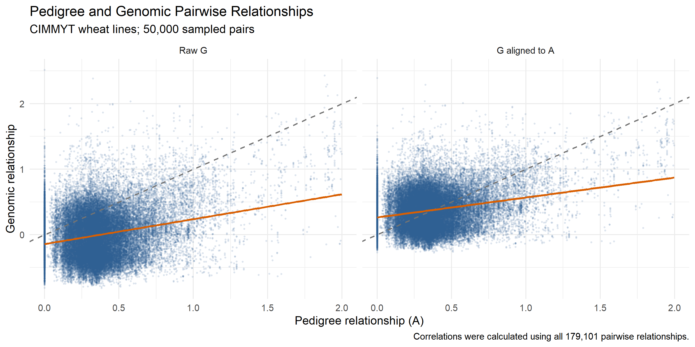

# Genomic Prediction Demo

A reproducible comparison of pedigree-based BLUP (PBLUP), genomic BLUP (GBLUP), and single-step GBLUP (ssGBLUP) using the public CIMMYT wheat dataset distributed with the `BGLR` R package.

This project demonstrates an end-to-end genomic-prediction workflow: data quality control, pedigree and genomic relationship matrices, kernel-based mixed models, repeated cross-validation, partial genotyping, and single-step integration of pedigree and genomic information.

## Key results

Model performance was evaluated using five repeats of five-fold cross-validation. Values are the mean ± standard deviation across 25 repeat-fold combinations.

### Full-genotyping scenario

| Model | Predictive correlation | RMSE          | MAE           |
| ----- | ----------------------:| -------------:| -------------:|
| PBLUP | 0.427 ± 0.064          | 0.910 ± 0.042 | 0.720 ± 0.036 |
| GBLUP | 0.492 ± 0.073          | 0.874 ± 0.042 | 0.692 ± 0.032 |

Relative to PBLUP, GBLUP increased predictive correlation by 0.065 on average and reduced RMSE by 0.036. It performed better in 21 of the 25 paired splits for all three primary metrics.



### Partial-genotyping scenario

A fixed, phenotype-independent random sample of 300 of the 599 wheat lines was treated as genotyped. The remaining 299 lines retained pedigree and phenotype information but did not contribute marker information to the genomic relationship matrix.

| Testing group | Model   | Predictive correlation | RMSE          | MAE           |
| ------------- | ------- | ----------------------:| -------------:| -------------:|
| All lines     | PBLUP   | 0.427 ± 0.064          | 0.910 ± 0.042 | 0.720 ± 0.036 |
| All lines     | ssGBLUP | 0.458 ± 0.087          | 0.893 ± 0.046 | 0.709 ± 0.036 |
| Genotyped     | PBLUP   | 0.392 ± 0.095          | 0.914 ± 0.077 | 0.722 ± 0.064 |
| Genotyped     | ssGBLUP | 0.436 ± 0.122          | 0.894 ± 0.092 | 0.711 ± 0.071 |
| Non-genotyped | PBLUP   | 0.454 ± 0.079          | 0.903 ± 0.061 | 0.718 ± 0.056 |
| Non-genotyped | ssGBLUP | 0.480 ± 0.086          | 0.888 ± 0.059 | 0.707 ± 0.054 |

ssGBLUP improved mean predictive correlation and error metrics for both genotyped and non-genotyped testing lines. The improvement among non-genotyped lines illustrates how single-step models can propagate genomic information through pedigree relationships.



The full-genotyping GBLUP and 50%-genotyping ssGBLUP results represent different information scenarios and are therefore not treated as a direct model ranking.

## Dataset

The analysis uses the CIMMYT wheat dataset included with `BGLR`:

- 599 historical wheat lines
- 1,279 binary DArT markers
- four standardized grain-yield environments
- a pedigree-derived additive relationship matrix
- Environment 1 grain yield as the prediction target
- no missing Environment 1 phenotypes or marker scores

Markers with minor allele frequency below 0.05 were removed. Because the wheat lines are highly inbred, the binary marker states were represented as the two homozygous classes, −1 and +1, for genomic relationship-matrix construction.



## Methods

### Relationship matrices

PBLUP used the supplied pedigree relationship matrix $A$.

The genomic relationship matrix $G$ was constructed from the filtered marker matrix using `rrBLUP::A.mat`.

For the partial-genotyping analysis, $G_{22}$ was constructed using only the 300 genotyped lines. Marker frequencies and minor allele frequencies were recalculated within that subset. $G_{22}$ was then aligned to the scale of the corresponding pedigree submatrix $A_{22}$.

The inverse single-step relationship matrix was constructed as

$$
H^{-1}
=
A^{-1}
+
\begin{bmatrix}
0 & 0 \\
0 & G_{22}^{-1} - A_{22}^{-1}
\end{bmatrix}.

$$

The resulting $H^{-1}$ and $H$ matrices were checked for symmetry, finite values, positive eigenvalues, identifier alignment, and inverse-reconstruction error.



### Prediction models

All three models were fitted as kernel-based mixed models using `rrBLUP::mixed.solve`:

- **PBLUP:** pedigree relationship kernel $A$
- **GBLUP:** genomic relationship kernel $G$
- **ssGBLUP:** combined relationship kernel $H$

For each validation split, testing phenotypes were masked before model fitting. Pedigree and marker relationships for testing candidates remained available, as expected in selection-candidate prediction.

### Validation design

The main evaluation used five repeats of five-fold cross-validation:

- 25 train-test splits
- 479 or 480 training lines per split
- 119 or 120 testing lines per split
- identical splits for paired model comparisons
- predictive correlation, RMSE, and MAE as primary metrics

A separate fixed 80/20 split is retained as a pipeline-validation example rather than as the final model ranking.

Because folds overlap across repeated cross-validation, split-level summaries and better-split counts are descriptive rather than formal independent-sample significance tests.

## Reproduce the analysis

The project uses `renv` to record package versions.

```r
install.packages("renv")
renv::restore()
```

Run the complete workflow from the repository root:

```bash
Rscript run_all.R
```

The script executes all six analysis stages in order and regenerates the CSV outputs and figures. The complete run includes 75 repeated-cross-validation model fits.

The main project-level outputs are:

- `results/final_model_performance.csv`
- `results/final_paired_improvements.csv`
- `figures/repeated_cv_model_comparison.png`
- `figures/partial_genotyping_model_comparison.png`

## Project structure

```text
genomic-prediction-demo/
├── R/
│   ├── 01_load_and_qc.R
│   ├── 02_relationship_matrices.R
│   ├── 03_fit_blup.R
│   ├── 04_cross_validation.R
│   ├── 05_partial_genotyping.R
│   └── 06_summarise_results.R
├── figures/
├── results/
├── renv/
├── renv.lock
├── run_all.R
├── TASKS.md
└── README.md
```

## Scope and limitations

This repository is a compact methodological demonstration rather than a breeding-program deployment study.

- Only Environment 1 was used as the prediction target.
- The partial-genotyping scenario used one fixed random 50% sample.
- Genotyping status was simulated rather than based on an operational selection strategy.
- Marker effects and genotype-by-environment interactions were not modelled separately.
- Hyperparameter tuning and comparisons with Bayesian or nonlinear genomic-prediction models were outside the present scope.
- Repeated cross-validation summaries should not be interpreted as independent hypothesis-test replicates.

These limitations provide natural extensions for multi-environment genomic prediction, optimized genotyping strategies, Bayesian models, and genotype-by-environment analysis.

## Software

The workflow was developed in R and primarily uses:

- `BGLR` for the public wheat dataset
- `rrBLUP` for relationship matrices and mixed-model fitting
- `ggplot2` for figures
- `here` for project-relative paths
- `renv` for dependency management

## License

This project is released under the MIT License.
